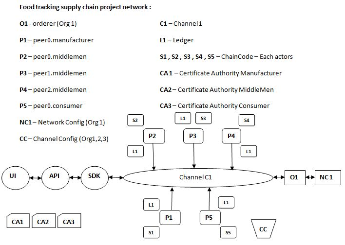

# SupplyChain - HLF project :

## Objective :

In the traditional supply chain models, the information about an entity is not fully transparent to others, which leads to inaccurate reports and a lack of interoperability. Emails and printed documents provide certain information, but still can’t contain fully detailed visibility and traceability information since the products across the entire supply chain are hard to trace. It is almost impossible for the consumer to know the true value of the product they purchased.
Since the blockchain is a transparent, immutable, and secure decentralized system, it is considered to be a game-changing solution for traditional supply chain industries. It can help to build an effective supply chain system by improving the following areas:

          * Tracking the products in the entire chain
          * Verifying and authenticating the products in the chain
          * Sharing the entire chain information between supply chain actors 
          * Providing better auditability

## Use case :

* Farm to fork tracking
* Diamond tracking
* High priced goods such as Leather goods , watches , dresses etc.

## Components Developed :
	
* Frontend app with React.js
* Middleware APIs using Node
* Node.js for SDK
* Network - Hyperledger Fabric
* Chaincode - GoLang

## Users in this Application :

* Manufacture
* WholeSeller
* Distributor
* Retailer 
* Consumer

## Application Architecture :

## Application Flow :

* Users are enrolled into the application by an Admin.
* New Products will be created by the Manufacturer only.
* Then Product will be sent to WholeSeller
* Wholesalers will send the product to the Distributor.
* Distributor will send it to Retailer 
* Consumer could place the order 
* Consumer will mark as Delivered once the product is delivered

## Fabric Network details :

* Three Orgs (Manufacturer/MiddleMen/Consumer)
* Five peers
* One Orderer (Org1)
* One Channel 
* Three Certificate Authority (Each org 1 CA)
* Fabric network implemented with Fabric CA as certificate authority. 

## Chaincode Functions :

* createUser (Admin)
* signIn (user Login)
* createProduct: ( Manufacturer) 
* updateProduct (Manufacturer,Wholesaler,Distributor,Retailer)
* sendToWholesaler
* sendToDistributor 
* sendToRetailer 
* sellToConsumer 
* QueryAsset (Query by Product ID) 
* QueryAll (All ) 
* orderProduct(Consumer places order , productID -> Retailer)
* deliveredProduct (Retailer Updates)
* Init - Initialize Counters to NIL
* Invoke - To invoke each function in the chaincode

## Planned APIs :

* User SignIn
* createProduct
* sendToWholesealer
* sendToDistributor
* sendToRetailer
* sellToCustomer
* Update product
* Email Notification service for above APIs

# Steps to up the network using shell scripts :
 1. sudo docker ps --all
 2. ./stopNetwork.sh
 3. ./teardown.sh
 4. ./operate.sh up

# Steps to run the API server

cd web-app/servers/

npm install

nodemon app.js

# Steps to up the network using commands :

### 1. generate certificates

../bin/cryptogen generate --config=./artifacts/crypto-config.yaml --output=./artifacts/network/crypto-config

#### 2. export

export FABRIC_CFG_PATH=${PWD}/artifacts

#### 3. generate the genesis block

../bin/configtxgen -profile TraceOrdererGenesis -outputBlock ./artifacts/network/genesis.block

#### 4. export channel name

export CHANNEL_NAME=supplychainchannel

#### 5. generate the channel transaction file

../bin/configtxgen -profile TraceOrgsChannel -outputCreateChannelTx ./artifacts/network/channel.tx -channelID $CHANNEL_NAME

#### 6. update anchor peers

../bin/configtxgen -profile TraceOrgsChannel -outputAnchorPeersUpdate ./artifacts/network/ManufacturerMSPanchors.tx -channelID $CHANNEL_NAME -asOrg ManufacturerMSP

../bin/configtxgen -profile TraceOrgsChannel -outputAnchorPeersUpdate ./artifacts/network/MiddleMenMSPanchors.tx -channelID $CHANNEL_NAME -asOrg MiddleMenMSP

../bin/configtxgen -profile TraceOrgsChannel -outputAnchorPeersUpdate ./artifacts/network/ConsumerMSPanchors.tx -channelID $CHANNEL_NAME -asOrg ConsumerMSP

#### 7. up the network

export MANUFACTURER_CA_PRIVATE_KEY=$(cd ./artifacts/network/crypto-config/peerOrganizations/manufacturer.example.com/ca && ls *_sk)

export MIDDLEMEN_CA_PRIVATE_KEY=$(cd ./artifacts/network/crypto-config/peerOrganizations/middlemen.example.com/ca && ls *_sk)

export CONSUMER_CA_PRIVATE_KEY=$(cd ./artifacts/network/crypto-config/peerOrganizations/consumer.example.com/ca && ls *_sk)

docker-compose -f artifacts/docker-compose.yaml up -d

#### 8. get into CLI 

docker exec -it cli bash

#### 9. export channel name

export CHANNEL_NAME=supplychainchannel

#### 10. create channel

peer channel create -o orderer.example.com:7050 -c $CHANNEL_NAME -f ./channel-artifacts/channel.tx --tls $CORE_PEER_TLS_ENABLED --cafile /opt/gopath/src/github.com/hyperledger/fabric/peer/crypto/ordererOrganizations/example.com/orderers/orderer.example.com/msp/tlscacerts/tlsca.example.com-cert.pem

#### 11. peer 0 manufacturer join channel

peer channel join -b supplychainchannel.block

#### 12. peer 0 middlemen join channel

CORE_PEER_MSPCONFIGPATH=/opt/gopath/src/github.com/hyperledger/fabric/peer/crypto/peerOrganizations/middlemen.example.com/users/Admin@middlemen.example.com/msp
CORE_PEER_ADDRESS=peer0.middlemen.example.com:8051
CORE_PEER_LOCALMSPID="MiddleMenMSP"
CORE_PEER_TLS_ROOTCERT_FILE=/opt/gopath/src/github.com/hyperledger/fabric/peer/crypto/peerOrganizations/middlemen.example.com/peers/peer0.middlemen.example.com/tls/ca.crt peer channel join -b $CHANNEL_NAME.block

##### peer 1 middlemen join channel 

CORE_PEER_MSPCONFIGPATH=/opt/gopath/src/github.com/hyperledger/fabric/peer/crypto/peerOrganizations/middlemen.example.com/users/Admin@middlemen.example.com/msp
CORE_PEER_ADDRESS=peer1.middlemen.example.com:9051
CORE_PEER_LOCALMSPID="MiddleMenMSP"
CORE_PEER_TLS_ROOTCERT_FILE=/opt/gopath/src/github.com/hyperledger/fabric/peer/crypto/peerOrganizations/middlemen.example.com/peers/peer1.middlemen.example.com/tls/ca.crt peer channel join -b $CHANNEL_NAME.block

##### peer 2 middlemen join channel

CORE_PEER_MSPCONFIGPATH=/opt/gopath/src/github.com/hyperledger/fabric/peer/crypto/peerOrganizations/middlemen.example.com/users/Admin@middlemen.example.com/msp
CORE_PEER_ADDRESS=peer2.middlemen.example.com:10051
CORE_PEER_LOCALMSPID="MiddleMenMSP"
CORE_PEER_TLS_ROOTCERT_FILE=/opt/gopath/src/github.com/hyperledger/fabric/peer/crypto/peerOrganizations/middlemen.example.com/peers/peer2.middlemen.example.com/tls/ca.crt peer channel join -b $CHANNEL_NAME.block

##### peer 0 consumer join channel

CORE_PEER_MSPCONFIGPATH=/opt/gopath/src/github.com/hyperledger/fabric/peer/crypto/peerOrganizations/consumer.example.com/users/Admin@consumer.example.com/msp
CORE_PEER_ADDRESS=peer0.consumer.example.com:11051
CORE_PEER_LOCALMSPID="ConsumerMSP"
CORE_PEER_TLS_ROOTCERT_FILE=/opt/gopath/src/github.com/hyperledger/fabric/peer/crypto/peerOrganizations/consumer.example.com/peers/peer0.consumer.example.com/tls/ca.crt peer channel join -b $CHANNEL_NAME.block

#### 13. update anchor peers

peer 0 manufacturer

CORE_PEER_MSPCONFIGPATH=/opt/gopath/src/github.com/hyperledger/fabric/peer/crypto/peerOrganizations/manufacturer.example.com/users/Admin@manufacturer.example.com/msp
CORE_PEER_ADDRESS=peer0.manufacturer.example.com:7051
CORE_PEER_LOCALMSPID="ManufacturerMSP"
CORE_PEER_TLS_ROOTCERT_FILE=/opt/gopath/src/github.com/hyperledger/fabric/peer/crypto/peerOrganizations/manufacturer.example.com/peers/peer0.manufacturer.example.com/tls/ca.crt
peer channel update -o orderer.example.com:7050 -c $CHANNEL_NAME -f ./channel-artifacts/ManufacturerMSPanchors.tx --tls --cafile /opt/gopath/src/github.com/hyperledger/fabric/peer/crypto/ordererOrganizations/example.com/orderers/orderer.example.com/msp/tlscacerts/tlsca.example.com-cert.pem

peer 0 middlemen

CORE_PEER_MSPCONFIGPATH=/opt/gopath/src/github.com/hyperledger/fabric/peer/crypto/peerOrganizations/middlemen.example.com/users/Admin@middlemen.example.com/msp
CORE_PEER_ADDRESS=peer0.middlemen.example.com:8051
CORE_PEER_LOCALMSPID="MiddleMenMSP"
CORE_PEER_TLS_ROOTCERT_FILE=/opt/gopath/src/github.com/hyperledger/fabric/peer/crypto/peerOrganizations/middlemen.example.com/peers/peer0.middlemen.example.com/tls/ca.crt
peer channel update -o orderer.example.com:7050 -c $CHANNEL_NAME -f ./channel-artifacts/MiddleMenMSPanchors.tx --tls --cafile /opt/gopath/src/github.com/hyperledger/fabric/peer/crypto/ordererOrganizations/example.com/orderers/orderer.example.com/msp/tlscacerts/tlsca.example.com-cert.pem

peer 0 consumer

CORE_PEER_MSPCONFIGPATH=/opt/gopath/src/github.com/hyperledger/fabric/peer/crypto/peerOrganizations/consumer.example.com/users/Admin@consumer.example.com/msp
CORE_PEER_ADDRESS=peer0.consumer.example.com:11051
CORE_PEER_LOCALMSPID="ConsumerMSP"
CORE_PEER_TLS_ROOTCERT_FILE=/opt/gopath/src/github.com/hyperledger/fabric/peer/crypto/peerOrganizations/consumer.example.com/peers/peer0.consumer.example.com/tls/ca.crt
peer channel update -o orderer.example.com:7050 -c $CHANNEL_NAME -f ./channel-artifacts/ConsumerMSPanchors.tx --tls --cafile /opt/gopath/src/github.com/hyperledger/fabric/peer/crypto/ordererOrganizations/example.com/orderers/orderer.example.com/msp/tlscacerts/tlsca.example.com-cert.pem

#### 14. install chaincode

peer 0 manufacturer

CORE_PEER_MSPCONFIGPATH=/opt/gopath/src/github.com/hyperledger/fabric/peer/crypto/peerOrganizations/manufacturer.example.com/users/Admin@manufacturer.example.com/msp
CORE_PEER_ADDRESS=peer0.manufacturer.example.com:7051
CORE_PEER_LOCALMSPID="ManufacturerMSP"
CORE_PEER_TLS_ROOTCERT_FILE=/opt/gopath/src/github.com/hyperledger/fabric/peer/crypto/peerOrganizations/manufacturer.example.com/peers/peer0.manufacturer.example.com/tls/ca.crt
peer chaincode install -n supplychaincc -v 1.0 -p github.com/chaincode/

#### 15. instantiate or upgrade chaincode

peer chaincode instantiate -o orderer.example.com:7050 --tls --cafile /opt/gopath/src/github.com/hyperledger/fabric/peer/crypto/ordererOrganizations/example.com/orderers/orderer.example.com/msp/tlscacerts/tlsca.example.com-cert.pem -C $CHANNEL_NAME -n supplychaincc -l golang -v 1.0 -c '{"Args":[""]}' -P "OR ('ManufacturerMSP.peer','MiddleMenMSP.peer', 'ConsumerMSP.peer')"

peer chaincode upgrade -o orderer.example.com:7050 --tls --cafile /opt/gopath/src/github.com/hyperledger/fabric/peer/crypto/ordererOrganizations/example.com/orderers/orderer.example.com/msp/tlscacerts/tlsca.example.com-cert.pem -C $CHANNEL_NAME -n supplychaincc -l golang -v 1.2 -c '{"Args":[""]}' -P "OR ('ManufacturerMSP.peer','MiddleMenMSP.peer', 'ConsumerMSP.peer')"

#### 16. invoke chaincode

##### create users
peer chaincode invoke -o orderer.example.com:7050 --tls true --cafile /opt/gopath/src/github.com/hyperledger/fabric/peer/crypto/ordererOrganizations/example.com/orderers/orderer.example.com/msp/tlscacerts/tlsca.example.com-cert.pem -C $CHANNEL_NAME -n supplychaincc -c '{"Args":["createUser","kuldeep1","kk@asdf.asdf","manufacturer","rajapur"]}'

peer chaincode invoke -o orderer.example.com:7050 --tls true --cafile /opt/gopath/src/github.com/hyperledger/fabric/peer/crypto/ordererOrganizations/example.com/orderers/orderer.example.com/msp/tlscacerts/tlsca.example.com-cert.pem -C $CHANNEL_NAME -n supplychaincc -c '{"Args":["createUser","kuldeep2","kk@asdf.asdf","wholesaler","rajapur"]}'

peer chaincode invoke -o orderer.example.com:7050 --tls true --cafile /opt/gopath/src/github.com/hyperledger/fabric/peer/crypto/ordererOrganizations/example.com/orderers/orderer.example.com/msp/tlscacerts/tlsca.example.com-cert.pem -C $CHANNEL_NAME -n supplychaincc -c '{"Args":["createUser","kuldeep3","kk@asdf.asdf","distributor","rajapur"]}'

peer chaincode invoke -o orderer.example.com:7050 --tls true --cafile /opt/gopath/src/github.com/hyperledger/fabric/peer/crypto/ordererOrganizations/example.com/orderers/orderer.example.com/msp/tlscacerts/tlsca.example.com-cert.pem -C $CHANNEL_NAME -n supplychaincc -c '{"Args":["createUser","kuldeep4","kk@asdf.asdf","retailer","rajapur"]}'

peer chaincode invoke -o orderer.example.com:7050 --tls true --cafile /opt/gopath/src/github.com/hyperledger/fabric/peer/crypto/ordererOrganizations/example.com/orderers/orderer.example.com/msp/tlscacerts/tlsca.example.com-cert.pem -C $CHANNEL_NAME -n supplychaincc -c '{"Args":["createUser","kuldeep4","kk@asdf.asdf","consumer","rajapur"]}'

##### create product
peer chaincode invoke -o orderer.example.com:7050 --tls true --cafile /opt/gopath/src/github.com/hyperledger/fabric/peer/crypto/ordererOrganizations/example.com/orderers/orderer.example.com/msp/tlscacerts/tlsca.example.com-cert.pem -C $CHANNEL_NAME -n supplychaincc -c '{"Args":["createProduct","Kohinoor diamond","User1","1000"]}'

##### update product
peer chaincode invoke -o orderer.example.com:7050 --tls true --cafile /opt/gopath/src/github.com/hyperledger/fabric/peer/crypto/ordererOrganizations/example.com/orderers/orderer.example.com/msp/tlscacerts/tlsca.example.com-cert.pem -C $CHANNEL_NAME -n supplychaincc -c '{"Args":["updateProduct","Product1","User1","Kohinoor heera","1500"]}'

##### query product

peer chaincode invoke -o orderer.example.com:7050 --tls true --cafile /opt/gopath/src/github.com/hyperledger/fabric/peer/crypto/ordererOrganizations/example.com/orderers/orderer.example.com/msp/tlscacerts/tlsca.example.com-cert.pem -C $CHANNEL_NAME -n supplychaincc -c '{"Args":["queryAsset","Product1"]}'

##### sending product

peer chaincode invoke -o orderer.example.com:7050 --tls true --cafile /opt/gopath/src/github.com/hyperledger/fabric/peer/crypto/ordererOrganizations/example.com/orderers/orderer.example.com/msp/tlscacerts/tlsca.example.com-cert.pem -C $CHANNEL_NAME -n supplychaincc -c '{"Args":["sendToWholesaler","Product1","User2"]}'

peer chaincode invoke -o orderer.example.com:7050 --tls true --cafile /opt/gopath/src/github.com/hyperledger/fabric/peer/crypto/ordererOrganizations/example.com/orderers/orderer.example.com/msp/tlscacerts/tlsca.example.com-cert.pem -C $CHANNEL_NAME -n supplychaincc -c '{"Args":["sendToDistributer","Product1","User3"]}'

peer chaincode invoke -o orderer.example.com:7050 --tls true --cafile /opt/gopath/src/github.com/hyperledger/fabric/peer/crypto/ordererOrganizations/example.com/orderers/orderer.example.com/msp/tlscacerts/tlsca.example.com-cert.pem -C $CHANNEL_NAME -n supplychaincc -c '{"Args":["sendToRetailer","Product1","User4"]}'

##### order product

peer chaincode invoke -o orderer.example.com:7050 --tls true --cafile /opt/gopath/src/github.com/hyperledger/fabric/peer/crypto/ordererOrganizations/example.com/orderers/orderer.example.com/msp/tlscacerts/tlsca.example.com-cert.pem -C $CHANNEL_NAME -n supplychaincc -c '{"Args":["orderProduct","User5","Product1"]}'

##### sell to consumer product

peer chaincode invoke -o orderer.example.com:7050 --tls true --cafile /opt/gopath/src/github.com/hyperledger/fabric/peer/crypto/ordererOrganizations/example.com/orderers/orderer.example.com/msp/tlscacerts/tlsca.example.com-cert.pem -C $CHANNEL_NAME -n supplychaincc -c '{"Args":["sellToConsumer","Product1"]}'

##### delivered product

peer chaincode invoke -o orderer.example.com:7050 --tls true --cafile /opt/gopath/src/github.com/hyperledger/fabric/peer/crypto/ordererOrganizations/example.com/orderers/orderer.example.com/msp/tlscacerts/tlsca.example.com-cert.pem -C $CHANNEL_NAME -n supplychaincc -c '{"Args":["deliveredProduct","Product1"]}'

##### query asset

peer chaincode invoke -o orderer.example.com:7050 --tls true --cafile /opt/gopath/src/github.com/hyperledger/fabric/peer/crypto/ordererOrganizations/example.com/orderers/orderer.example.com/msp/tlscacerts/tlsca.example.com-cert.pem -C $CHANNEL_NAME -n supplychaincc -c '{"Args":["queryAsset","Product1"]}'

##### query all

peer chaincode invoke -o orderer.example.com:7050 --tls true --cafile /opt/gopath/src/github.com/hyperledger/fabric/peer/crypto/ordererOrganizations/example.com/orderers/orderer.example.com/msp/tlscacerts/tlsca.example.com-cert.pem -C $CHANNEL_NAME -n supplychaincc -c '{"Args":["queryAll","User"]}'

#### 17. down the network

docker-compose -f artifacts/docker-compose.yaml down -v

sudo rm -fR artifacts/network/

docker kill $(docker ps -aq)

docker rm $(docker ps -aq)

docker ps
